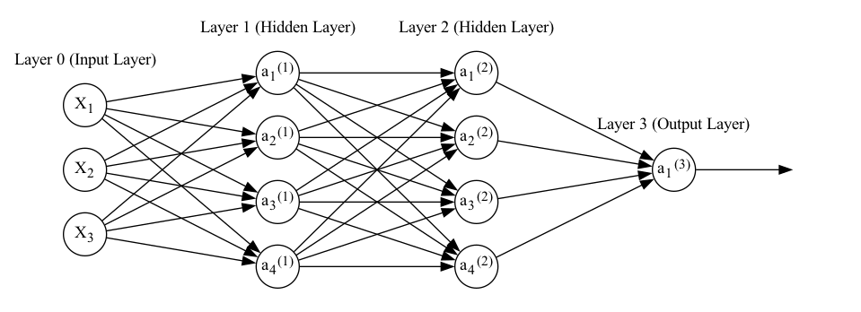

# Neurons and Networks

With the pre-requisite math established, we can now start considering the question: what actually is a 'neural network' anyway? If you're reading this page, there's a good chance you've seen a diagram that looks something like this:

:::{figure-md} neural-network-fig


A neural network with three inputs, two hidden layers with four nodes each, and a single output node
:::

But what is this diagram actually showing us?

## A Single Neuron

Before considering a whole neural network, it's worth looking at a single *node* in the network. Looking at the above plot, a neuron is simply a single node in the *hidden* or *output* *layers* in the plot (more on these later). In particular, we're going to consider the first neuron from the first hidden layer:

:::{figure-md} single-neuron-fig


A single neuron with three inputs
:::

For simplicity, we'll consider what happens to a single *training example* (observation) with *features* (variables) $\boldsymbol{X} = [X_1, X_2, X_3]$ and output $Y$.

The first thing to notice is that here we've split the neuron into two, whereas in the first diagram neurons were comprised of a single node. This representation is somewhat more accurate to what's going on, but the first diagram is useful for showing things at a higher level.

### In this node

To break this down step-by-step, $X_1$, $X_2$, and $X_3$ are scalars that go in, something happens and we get $z_1^{(1)}$. Then, this is passed on to $\sigma()$, $a_1^{(1)}$ is a scalar output, and this output is the output of the node..

Let's start at 'something happens' Each of the inputs to the node is mupltiplied by a weight: $w_{11}^{(1)}$ for $X_1$, $w_{12}^{(1)}$ for $X_2$, and $w_{13}^{(1)}$ for $X_3$. The results of these multiplications are then summed to make $z^{(1)}_1$.

### Generalising to all nodes in a layer

A general formulation of this is $w^{(l)}_{ji}$. Here, the subscript I'm using for each $w$ denotes the input node ($i$, second number) and output node ($j$, first number). The superscript $(l)$ denotes which layer the weight belongs to. The sum can be expressed as:

$$ z^{(l)}_j = \sum_k w_{jk}^{(l)} x_k $$

```{note}
I'm not bothering to index this by training example (althought strictly speaking we should) largely for the sake of simplicitly. Note that this will be true in some other equations on this page too. In general, individual elements such as $z^{(l)}_j$, $a^{(l)}_j$, and $x_k$ exist per training example and would be indexed by this if I was marginally less lazy as a person.
```

This sum of multiplications is of course a dot product. We can therefore use matrix notation to organise all of the summed multiplications we need to do. This allows us to represent all of the equations for neurons and training examples in the input layer in a single, concise formula:

$$ \boldsymbol{Z}^{(l)} = \boldsymbol{W}^{(l)}\boldsymbol{X'} $$

```{note}
A quick note for people used to social scientific notational conventions: $\boldsymbol{X}$ has been transposed such that it is a column vector where each element is a *feature* (or variable, in statistical parlance). If it became a matrix, each row would be a feature and each column a *training example* (observation).

This is different from a more typical representation found in statistics, but is at least semi-common in the deep learning world. I use this format here due to the fact this is the most common format in the documents I have learned from, but it's worth noting as this is not necessarily usual. More on dimensions below.

$\boldsymbol{X}$ won't always be presented with the $'$ symbol in all documents, but I've kept it on this page just to make this clear as it is fairly unusual.
```

### Biases

We also usually add a *bias* (intercept) $b^{(l)}_{j}$ (i.e. intercept) to this equation for each node:

$$ z^{(l)}_j = \sum_k w_{jk}^{(l)} x_k + b_j^{(l)} $$

Which in matrix form for all nodes and observations becomes (note the use of broadcasting here):

$$ \boldsymbol{Z}^{(l)} = \boldsymbol{W}^{(l)}\boldsymbol{X'} + \boldsymbol{b}^{(l)} $$

### Activation

To get $a_1^{(1)}$ from $z_1^{(1)}$, we apply an *activation function* $f(x)$. Don't worry too much about the choice of function for now: there are many valid choices. The important think to note is that this function will take the weighted input $Z$, and transform it in some way:

$$ a_1^{(1)} = f(z_1^{(1)}) = f \left( \sum_k w_{jk}^{(l)} x_k + b_j^{(l)} \right) $$

The neuron then provides $a_1^{(1)}$ as its output.

We can generalise this as:

$$ \boldsymbol{A}^{(l)} = f(\boldsymbol{Z}^{(l)}) = f(\boldsymbol{W}^{(l)}\boldsymbol{X'} + \boldsymbol{b}^{(l)}) $$

### Formulas for the First Hidden Layer

We therefore have clear formulas for the first hidden layer

$$ \boldsymbol{Z}^{(1)} = \boldsymbol{W}^{(1)}\boldsymbol{X'} + \boldsymbol{b}^{(1)} $$
$$ \boldsymbol{A}^{(1)} = f(\boldsymbol{Z}^{(1)}) $$

## Many Hidden Layers

So far, I've only considered the first 'hidden layer'. We can add an arbitary number of layers with an arbitary number of nodes. Each layer takes the previous layers' nodes as input, multiples them by a matrix of weights, passes them through an activation function, then provides the result as its output.

This also applies to the 'output layer': here the number of nodes corresponds to the number of outputs (i.e. one for predicting continous variables or binary classification, many for multi-class and multi-label classification). The only extension is that we'll also need an output activation function $g(x)$, which may or may not be different to the hidden layer activation function.

So, the weighted input and activation for layer $l$ in an $L$-layer (i.e. $L-1$ hidden layers, and an $L$th output layer) neural network is given by:

$$ \boldsymbol{Z}^{(l)} = \boldsymbol{W}^{(l)}\boldsymbol{A}^{(l-1)}  + \boldsymbol{b}^{(l)} $$
$$ \boldsymbol{A}^{(l)} = f(\boldsymbol{Z}^{(l)}) $$

```{note}
It's often helpful to pay attention to dimensions.

$\boldsymbol{W}^{(l)}$ has $n^{(l)} \times n^{(l-1)}$ elements, where $n^{(l)}$ is the number of nodes in layer $l$.

$\boldsymbol{b}^{(l)}$ has $n^{(l)} \times 1$ elements.

$\boldsymbol{A}^{(l)}$ and $\boldsymbol{Z}^{(l)}$ will have $n^{(l)} \times m$ elements, where $m$ is the number of training examples/observations.

A quick sanity check worth performing whenever building a neural network (or any other model that uses matrices) is to check what the dimensions of the outputs should be.
```

Just don't forget that for $l=1$, instead of multiplying by $\boldsymbol{a}^{(l-1)}$ we'll be multiplying by $\boldsymbol{X'}$. Finally, since the output layer has its own activation function:

$$ \boldsymbol{Z}^{(L)} = \boldsymbol{W}^{(L)}\boldsymbol{Z}^{(L-1)}  + \boldsymbol{b}^{(L)} $$
$$ \boldsymbol{A}^{(L)} = g(\boldsymbol{Z}^{(L)}) $$

## Networks are Composed Functions

So: a neural network takes several input features (or variables, if you prefer). It multiplies that input by a matrix of weights, passes the results through an element-wise activation function, then repeats that process for each layer until it produces an output.

The output activation function will usually be chosen based on the nature of the output(s) - more on this later.

Temporarily and for simplicity, let's imagine that $f(x)$ and $g(x)$ combine the multiplication and activation steps:

$$ f(\boldsymbol{X'}) = f(\boldsymbol{W}\boldsymbol{X'} + \boldsymbol{b}) $$

It's easy to see that a neural network as described so far is really just a series of composed functions. For example, for the network diagram above:

$$ nn(\boldsymbol{X'}) = g(f^{(2)}(f^{(1)}(\boldsymbol{X'}))) $$

Calculating the full output in this way is caled a *forward pass* or *forward propagation*.

It's worth noting that the kind of network described here is a *feedforward neural network*. This is because we pass all the nodes from one layer to the next layer. Different network *architectures* may pass the nodes on in different ways. Recurrent neural networks for instance have layers take inputs from nodes further up the network.

Hopefully, this also makes the reason for a lot of the prequisites clear. We want to estimate this network as a function of its error (more on specific choices of error function later). This error is a function of the weights $\boldsymbol{W}^{(l)}$ and biases $\boldsymbol{b}^{(l)}$.

Gradient descent is a good option for finding the minimum of a function (and we want to find the minimum of the error function). So we need to find the derivatives of the error function for the network with respect to $\boldsymbol{W}^{(l)}$ and $\boldsymbol{b}^{(l)}$. And for that we need vector calculus and the chain rule.
