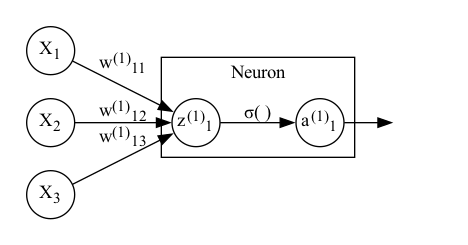

# Neurons and Networks

With the pre-requisite math established, we can now start considering the question: what actually is a 'neural network' anyway? If you're reading this page, there's a good chance you've seen a diagram that looks something like this:

:::{figure-md} neural-network-fig

A neural network with three inputs, two hidden layers with four nodes each, and a single output node
:::

But what is this diagram actually showing us?

## A Single Neuron

Before considering a whole neural network, it's worth looking at a single *node* in the network. Looking at the above plot, a neuron is simple a single node in the *hidden* or *output* *layers* in the plot (more on these later). In particular, we're going to consider the first neuron from the first hidden layer:

:::{figure-md} single-neuron-fig

A single neuron with three inputs
:::

For simplicity, we'll consider what happens to a single observation with features $\boldsymbol{X} = [X_1, X_2, X_3]$ and output $Y$.

So, $X_1$, $X_2$, and $X_3$ go in, something happens and $a_1^{(1)}$ is made, and something goes out.

Let's start at 'something happens' Each of the inputs to the node is mupltiplied by a weight: $w_{11}^{(1)}$ for $X_1$, $w_{12}^{(1)}$ for $X_2$, and $w_{13}^{(1)}$ for $X_3$. Here, the subscript I'm using for each $w$ denotes the input node (second number) and output node (first number). The superscript denotes which layer the weight belongs to. We can write this in matrix form as:

$$ \boldsymbol{W}_1^{(1)}\boldsymbol{X'} $$

We also usually add a *bias* (i.e. intercept) to this equation for each node, and it's useful to assign a the output to a variable. Let's call this $Z_1^{(1)}$:

$$ Z_1^{(1)} = \boldsymbol{W}^{(1)}_1\boldsymbol{X'} + b_1^{(1)} $$

To get $a_1^{(1)}$ from $Z_1^{(1)}$, we apply an *activation function* $f(x)$. Don't worry too much about the choice of function for now: there are many valid choices. The important think to note is that this function will take the weighted input $Z$, and transform it in some way:

$$ a_1^{(1)} = f(Z_1^{(1)}) = f(\boldsymbol{W}^{(1)}_1\boldsymbol{X'} + b_1^{(1)}) $$

The neuron then provides $a_1^{(1)}$ as its output.

## A Single Layer

We can easily generalise from a single neuron with a single output to many neurons with many outputs:

$$ \boldsymbol{Z}^{(1)} = \boldsymbol{W}^{(1)}\boldsymbol{X'} + \boldsymbol{b}^{(1)} $$
$$ \boldsymbol{a}^{(1)} = f(\boldsymbol{Z}^{(1)}) $$

## Many Hidden Layers

So far, I've only considered the first 'hidden layer'. We can add an arbitary number of layers with an arbitary number of nodes. Each layer takes the previous layers' nodes as input, multiples them by a matrix of weights, passes them through an activation function, then provides the result as its output.

This also applies to the 'output layer': here the number of nodes corresponds to the number of outputs (i.e. one for predicting continous variables or binary classification, many for multi-class and multi-label classification). The only extension is that we'll also need an output activation function $g(x)$, which may be different to the hidden layer activation function.

So, the weighted input and activation for layer $l$ in an $L$-layer (i.e. $L-1$ hidden layers, and an $L$th output layer) neural network is given by:

$$ \boldsymbol{Z}^{(l)} = \boldsymbol{W}^{(l)}\boldsymbol{a}^{(l-1)}  + \boldsymbol{b}^{(l)} $$
$$ \boldsymbol{a}^{(l)} = f(\boldsymbol{Z}^{(l)}) $$

Just don't forget that for $l=1$, instead of multiplying by $\boldsymbol{a}^{(l-1)}$ we'll be multiplying by $\boldsymbol{X'}$. Finally, since the output layer has its own activation function:

$$ \boldsymbol{Z}^{(L)} = \boldsymbol{W}^{(L)}\boldsymbol{Z}^{(L-1)}  + \boldsymbol{b}^{(L)} $$
$$ \boldsymbol{a}^{(L)} = g(\boldsymbol{Z}^{(L)}) $$

## Networks are Composed Functions

So: a neural network takes several input features (or variables, if you prefer). It multiplies that input by a matrix of weights, passes the results through an element-wise activation function, then repeats that process for each layer until it produces an output.

The output activation function will usually be chosen based on the nature of the output(s) - more on this later.

Temporarily and for simplicity, let's imagine that $f(x)$ and $g(x)$ combine the multiplication and activation steps:

$$ f(\boldsymbol{X'}) = f(\boldsymbol{W}\boldsymbol{X'} + \boldsymbol{b}) $$

It's easy to see that a neural network as described so far is really just a series of composed functions. For example, for the network diagram above:

$$ nn(\boldsymbol{X'}) = g(f^{(2)}(f^{(1)}(\boldsymbol{X'}))) $$

Calculating the full output in this way is caled a *forward pass* or *forward propagation*.

It's worth noting that the kind of network described here is a *feedforward neural network*. This is because we pass all the nodes from one layer to the next layer. Different network *architectures* may pass the nodes on in different ways. Recurrent neural networks for instance have layers take inputs from nodes further up the network.

Hopefully, this also makes the reason for a lot of the prequisites clear. We want to estimate this network as a function of its error (more on specific choices of error function later). This error is a function of the weights $\boldsymbol{W}^{(l)}$ and biases $\boldsymbol{b}^{(l)}$.

Gradient descent is a good option for finding the minimum of a function (and we want to find the minimum of the error function). So we need to find the derivatives of the error function for the network with respect to $\boldsymbol{W}^{(l)}$ and $\boldsymbol{b}^{(l)}$. And for that we need vector calculus and the chain rule.

## What Makes Neural Networks So Good?

Before proceeding, it's worth mentioning *why* neural networks work so well. After all, there are much simpler, less opaque algorithms out there (many of which will be familiar to readers with a similar background to mine).

In short, much of the magic happens because of the activation functions. Without these, all a neural network could do is produce a linear re-weighting of the input variables.

However, when we choose non-linear activation functions, it turns out that neural networks of arbitrary size can approximate any function. In other words, they are robust to non-linearities and interactions in the data generating process! Pretty useful when your goal is prediction.
